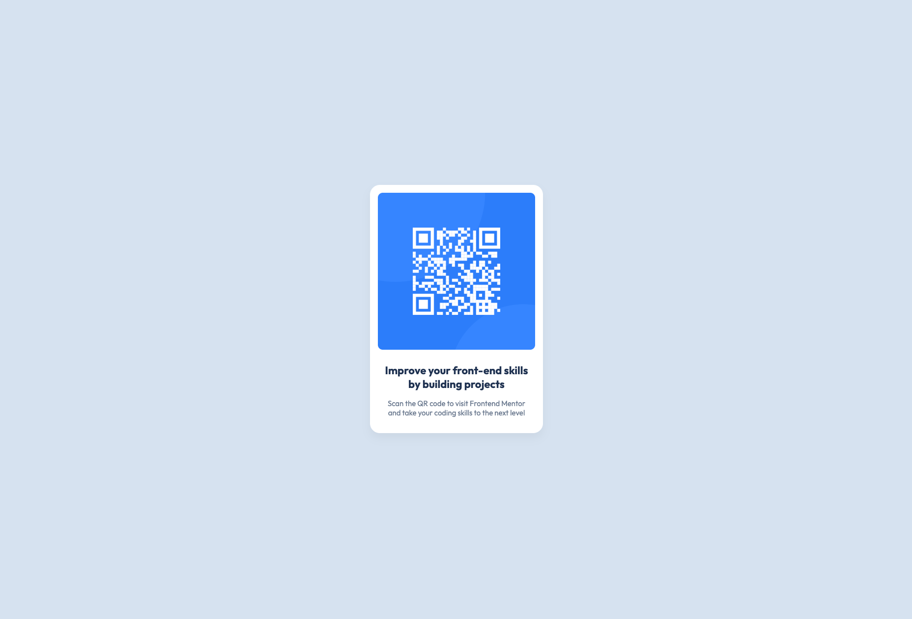

# Frontend Mentor - QR code component solution

This is a solution to the [QR code component challenge on Frontend Mentor](https://www.frontendmentor.io/challenges/qr-code-component-iux_sIO_H). Frontend Mentor challenges help you improve your coding skills by building realistic projects. 

## Table of contents

- [Overview](#overview)
  - [Screenshot](#screenshot)
  - [Links](#links)
- [My process](#my-process)
  - [Built with](#built-with)
  - [What I learned](#what-i-learned)
  - [Continued development](#continued-development)
  - [Useful resources](#useful-resources)
  - [AI Collaboration](#ai-collaboration)
- [Author](#author)
- [Acknowledgments](#acknowledgments)

## Overview

### Screenshot

### Links

- Solution URL: [Add solution URL here](https://github.com/rosaluebbe-coder/qr-code-component.io)
- Live Site URL: [Add live site URL here](https://rosaluebbe-coder.github.io/qr-code-component.io/)

## My process

### Built with

- Semantic HTML5 markup
- CSS custom properties
- Flexbox

### What I learned

I learned about the common structure of an html file according to wcag. I understood why you name an alt-text spefically and not general. Also I learned about the general sturcture of css file and how they relate to the html. This was the first time I used a flex box. 

### Continued development

I still need to leardn the most common css tags, but also even some html tags that I was not aware of yet (like main instead of div). 

### Useful resources

- https://developer.mozilla.org/de/docs/Web/CSS/Reference/Properties
- https://www.w3.org/WAI/standards-guidelines/wcag/
- 

### AI Collaboration

- I had Gemini explain to me in a chat every part of the code that I had to build step by step. I asked it so many questions about how and why and general strukcture and again why. It was a very helpful and non-judgemental companion. 

## Author

- Frontend Mentor - [@rosaluebbe-coder](https://www.frontendmentor.io/profile/rosaluebbe-coder)

## Acknowledgments

Thanks to my coworker who introduced me to the course. 

